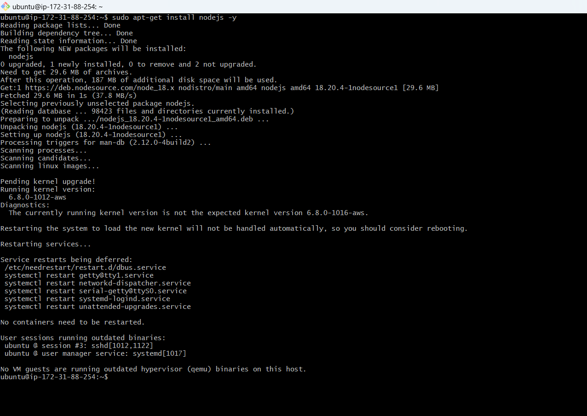
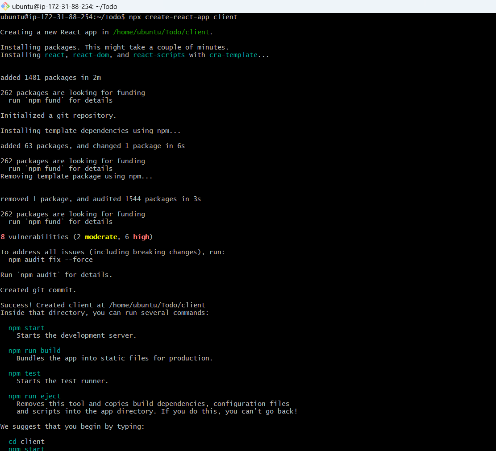

## MERN WEB STACK IMPLEMENTATION IN AWS


### Introduction

__The MERN stack is a popular choice for building dynamic web applications. It leverages a combination of JavaScript technologies:__

__MongoDB:__ A NoSQL document database for flexible data storage.

__Express.js:__ A lightweight web framework for Node.js that simplifies building APIs and web applications.

__React.js:__ A powerful library for creating interactive user interfaces.

__Node.js:__ A JavaScript runtime environment that allows execution of server-side JavaScript code.__

__This guide provides a comprehensive overview of setting up and utilizing each component of the MERN stack, to develop robust web applications.__


## Step 0: Prerequisites

__1.__ EC2 Instance of t3.small type and Ubuntu 24.04 LTS (HVM) was lunched in the us-east-1 region using the AWS console.
The choice of the instance type was based on the following:

- __Memory:__ The t3.small instance offers more memory than the t2.micro, which is advantageous for applications that require more memory to operate efficiently.

- __Burst Capability:__ While both instances offer burstable CPU performance, the t3 instances have a more flexible burst model, allowing for more sustained performance during burst periods. This is important for workloads that require consistent performance over longer periods.

- __Performance:__ While both instances offer burstable performance, the t3.small typically provides better baseline performance compared to the t2.micro. This might be necessary for applications that require a bit more processing power.

##  __Note:__ When starting my project, I initially launched an EC2 instance with a t2.micro configuration. However, this setup proved insufficient due to the higher memory and CPU requirements of Node.js. As a result, I upgraded the instance to t2.medium, which resolved the performance issues, and the project began running smoothly. I recommend ensuring that your EC2 instance has adequate resources to meet the official requirements of Node.js and your specific project before deployment. Additionally, be mindful that when migrating to a different instance type, your public IP address may change, requiring updates to any relevant configurations.


__2.__ Attached SSH key named __mern-server-ec2-key__ to access the instance on port 22

__3.__ The security group was configured with the following inbound rules:

- Allow traffic on port 80 (HTTP) with source from anywhere on the internet.

- Allow traffic on port 443 (HTTPS) with source from anywhere on the internet.

- Allow traffic on port 22 (SSH) with source from any IP address. This is opened by default.

- Allow traffic on port 5000 (Custom TCP) with source from anywhere.

- Allow traffic on port 3000 (Custom TCP) with sourec from anywhere.


__4.__ The private ssh key permission was changed for the private key file and then used to connect to the instance by running
```bash
chmod 400 mern-server-ec2-key.pem
```
```bash
ssh -i "mern-server-ec2-key.pem" ubuntu@3.83.205.28
```
Where __username=ubuntu__ and __public ip address=54.175.65.60__


## Step 1 - Backend Configuration

__1.__ __Update and upgrade the server’s package index__

```bash
sudo apt update
sudo apt upgrade -y
```


__2.__ __Get the location of Node.js software from ubuntu repositories__.

```bash
curl fsSL https://deb.nodesource.com/setup_18.x | sudo -E bash -
```


__3.__ __Install node.js with the command below__.

```bash
sudo apt-get install nodejs -y
```


__Note:__ the above command installs both node.js and npm. NPM is a package manager for Node just as apt is a package manager for Ubuntu. It is used to install Node modules and packages and to manage dependency conflicts.

__4.__ __Verify the Node installation with the command below__.

```bash
node -v        // Gives the node version

npm -v        // Gives the node package manager version
```


### Application Code Setup

__1.__ __Create a new directory for the TO-DO project and switch to it. Then initialize the project directory.__
```bash
mkdir Todo 
ls
cd Todo

npm init
```


This is to initialize the project directory and in the process, creates a new file called package.json. This file will contain information about your application and the dependencies it needs to run.
Follow the prompts after running the command. You can press “Enter” several times to accept default values, then accept to write out the package.json file by typing yes.


### Install ExpressJs

Express is a framework for Node.js. It simplifies development and abstracts a lot of low level details. For example, express helps to define routes of your application based on HTTP methods and URLs.

__1.__ __Install Express using npm__

```bash
npm install express
```


__2.__ __Create a file index.js and run ls to confirm the file__

```bash
touch index.js && ls
```


__3.__ __Install dotenv module__
```bash
npm install dotenv
```


__4.__ __Open index.js file__
```bash
vim index.js
```
Type the code below into it

```bash
const express = require('express');
require('dotenv').config();

const app = express();

const port = process.env.PORT || 5000;

app.use((req, res, next) => {
  res.header("Access-Control-Allow-Origin", "*");
  res.header("Access-Control-Allow-Headers", "Origin, X-Requested-With, Content-Type, Accept");
  next();
});

app.use((req, res, next) => {
  res.send('Welcome to Express');
});

app.listen(port, () => {
  console.log(`Server running on port ${port}`);
});
```


__Note:__ Port 5000 have been specified to be used in the code. This was required later on the browser.

__5.__ __Start the server to see if it works. Open your terminal in the same directory as your index.js file. Run__
```bash
node index.js
```


Now we need to open this port in EC2 Security Groups. Refer to Project 1 Step 1 – Installing the Nginx Web Server. There we created an inbound rule to open TCP port 80, you need to do the same for port 5000, like this:.


__Open up your browser and try to access your server's Public IP or Public DNS name followed by port 5000:__

```bash
http://<PublicIP-or-PublicDNS>:5000
```


## Quick_ reminder how to get your server's Public IP and public DNS name: 
__1.__ __You can find it in your AWS web console in EC2 details 

__2.__ __Run curl -s http://169.254.169.254/latest/meta-data/public-ipv4 for Public IP address or curl -s http://169.254.169.254/latest/meta-data/public-hostname for Public DNS name.__


## Routes

There are three actions that the ToDo application needs to be able to do:
- Create a new task
- Display list of all task
- Delete a completed task

Each task was associated with some particular endpoint and used different standard __HTTP__ request methods: __POST__, __GET__, __DELETE__.

For each task, routes were created which defined various endpoints that the ToDo app depends on.

__1.__ __Create a folder routes, switch to routes directory and create a file api.js. Open the file__
```bash
mkdir routes 
cd routes 
touch api.js
```


__Copy__ the code below into the file

```bash
const express = require('express');
const router = express.Router();

router.get('/todos', (req, res, next) => {

});

router.post('/todos', (req, res, next) => {

});

router.delete('/todos/:id', (req, res, next) => {

});

module.exports = router;
```


## Models

A model is at the heart of JavaScript based applications and it is what makes it interactive.

Models was used to define the database schema. This is important in order be able to define the fields stored in each Mongodb document.

In essence, the schema is a blueprint of how the database is constructed, including other data fields that may not be required to be stored in the database. These are known as virtual properties.
To create a schema and a model, mongoose  was installed, which is a Node.js package that makes working with mongodb easier.

__1.__ __Change the directory back to Todo folder and install mongoose__
```bash
npm install mongoose
```


__2.__ __Create a new folder models, switch to models directory, create a file todo.js inside models. Open the file__

```bash
mkdir models && cd models && touch todo.js
```


Past the code below into the file

```bash
const mongoose = require('mongoose');
const Schema = mongoose.Schema;

// Create schema for todo
const TodoSchema = new Schema({
  action: {
    type: String,
    required: [true, 'The todo text field is required']
  }
});

// Create model for todo
const Todo = mongoose.model('todo', TodoSchema);

module.exports = Todo;
```


The routes was updated from the file api.js in the ‘routes’ directory to make use of the new model.

__3.__ __In Routes directory, open api.js and delete the code inside with :%d__.

```bash
vim api.js
```

Paste the new code below into it
```bash
const express = require('express');
const router = express.Router();
const Todo = require('../models/todo');

router.get('/todos', (req, res, next) => {
  // This will return all the data, exposing only the id and action field to the client
  Todo.find({}, 'action')
    .then(data => res.json(data))
    .catch(next);
});

router.post('/todos', (req, res, next) => {
  if (req.body.action) {
    Todo.create(req.body)
      .then(data => res.json(data))
      .catch(next);
  } else {
    res.json({
      error: "The input field is empty"
    });
  }
});

router.delete('/todos/:id', (req, res, next) => {
  Todo.findOneAndDelete({"_id": req.params.id})
    .then(data => res.json(data))
    .catch(next);
});

module.exports = router;
```


## MongoDB Database

__mLab__ provides MongoDB database as a service solution (DBaaS). MongoDB has two cloud database management system components: mLab and Atlas, Both were formerly cloud databases managed by MongoDB (MongoDB acquired mLab in 2018, with certain differences). In November, MongoDB merged the two cloud databases and as such, __mLab.com__ redirects to the __MongoDB Atlas website__.

__1.__ __Create a MongoDB database and collection inside mLab__

MongoDB Cluster Overview


AWS cloud provider, in region N. Virginia (us-east-1) was selected.


Access from anywhere to the MongoDB database was allowed (Not secure but it is ideal for testing).


__Create a MongoDB database and collection inside mLab__ 


__2.__ __Create a file in your Todo directory and name it .env, open the file__

```bash
touch .env && vim .env
```


Add connection string below to access the database


```bash
DB = ‘mongodb+srv://<username>:<password>@<network-address>/<dbname>?retryWrites=true&w=majority’
```


__3.__ __Update the index.js to reflect the use of .env so that Node.js can connect to the database__.

```bash
vim index.js
```
Delete existing content in the file, and update it with the entire code below:

```bash
const express = require('express');
const bodyParser = require('body-parser');
const mongoose = require('mongoose');
const routes = require('./routes/api');
const path = require('path');
require('dotenv').config();

const app = express();

const port = process.env.PORT || 5000;

// Connect to the database
mongoose.connect(process.env.DB, { useNewUrlParser: true, useUnifiedTopology: true })
  .then(() => console.log(`Database connected successfully`))
  .catch(err => console.log(err));

// Since mongoose promise is deprecated, we override it with Node's promise
mongoose.Promise = global.Promise;

app.use((req, res, next) => {
  res.header("Access-Control-Allow-Origin", "*");
  res.header("Access-Control-Allow-Headers", "Origin, X-Requested-With, Content-Type, Accept");
  next();
});

app.use(bodyParser.json());

app.use('/api', routes);

app.use((err, req, res, next) => {
  console.log(err);
  next();
});

app.listen(port, () => {
  console.log(`Server running on port ${port}`);
});

```


Using environment variables to store information is considered more secure and best practice to separate configuration and secret data from the application, instead of writing connection strings directly inside the index.js application file.

__4.__ __Start your server using the command__
```bash
node index.js
```


There was a deprecation warning as diplayed in the image above.
To silent this warning, __{ useNewUrlParser: true, useUnifiedTopology: true }__ was removed from the code.


## Testing Backend Code without Frontend using RESTful API

Postman was used to test the backend code.
The endpoints were tested. For the endpoints that require body, JSON was sent back with the necessary fields since it’s what was set up in the code.

__1.__ __Open Postman and Set the header__

```bash
http://3.83.205.28:5000/api/todos
```


### Create POST requests to the API


### Check Database Collections


## Step 2 - Frontend Creation

It is time to create a user interface for a Web client (browser) to interact with the application via API

__1.__ __In the same root directory as your backend code, which is the Todo directory, run:__

```bash
npx create-react-app client
```


This created a new folder in the Todo directory called client, where all the react code was added.

### Running a React App

Before testing the react app, the following dependencies needs to be installed in the project root directory.

- __Install concurrently__. It is used to run more than one command simultaneously from the same terminal window.
```bash
npm install concurrently --save-dev
```


- __Install nodemon__. It is used to run and monitor the server. If there is any change in the server code, nodemon will restart it automatically and load the new changes.
```bash
npm install nodemon --save-dev
```


- In Todo folder open the package.json file, change the highlighted part of the below screenshot and replace with the code below:
```bash
"scripts": {
  "start": "node index.js",
  "start-watch": "nodemon index.js",
  "dev": "concurrently \"npm run start-watch\" \"cd client && npm start\""
}
```


### Configure Proxy In package.json

- Change directory to “client”
```bash
cd client
```

- Open the package.json file
```bash
vim package.json
```


Add the key value pair in the package.json file
```bash
“proxy”: “http://localhost:5000”
```


The whole purpose of adding the proxy configuration above is to make it possible to access the application directly from the browser by simply calling the server url like
http://locathost:5000 rather than always including the entire path like http://localhost:5000/api/todos

Ensure you are inside the Todo directory, and simply do:
```bash
npm run dev
```


The app opened and started running on localhost:3000

__Note__: In order to access the application from the internet, TCP port 3000 had been opened on EC2.


## Creating React Components

One of the advantages of react is that it makes use of components, which are reusable and also makes code modular. For the Todo app, there are two stateful components and one stateless component. From Todo directory, run:
 
 Move to the “src” directory

```bash
cd client && cd src
```


__2.__ __Inside your src folder, create another folder called “components”__

```bash
mkdir components
```
Move into the components directory
```bash
cd components
```


__3.__ __Inside the ‘components’ directory create three files “Input.js”, “ListTodo.js” and “Todo.js”.__
```bash
touch Input.js ListTodo.js Todo.js
```


#### Open Input.js file
```bash
vi Input.js
```
Paste in the following:

```
import React, { Component } from 'react';
import axios from 'axios';

class Input extends Component {
  state = {
    action: ""
  }

  handleChange = (event) => {
    this.setState({ action: event.target.value });
  }

  addTodo = () => {
    const task = { action: this.state.action };

    if (task.action && task.action.length > 0) {
      axios.post('/api/todos', task)
        .then(res => {
          if (res.data) {
            this.props.getTodos();
            this.setState({ action: "" });
          }
        })
        .catch(err => console.log(err));
    } else {
      console.log('Input field required');
    }
  }

  render() {
    let { action } = this.state;
    return (
      <div>
        <input type="text" onChange={this.handleChange} value={action} />
        <button onClick={this.addTodo}>add todo</button>
      </div>
    );
  }
}

export default Input;
```


In oder to make use of Axios, which is a Promise based HTTP client for the browser and node.js, you need to cd into your client from your terminal and run yarn add axios or npm install axios.

Move to the client folder
```bash
cd ..
cd ..
```
__Install Axios__
```bash
npm install axios
```


#### Go to components directory
```bash
cd src/components
```

#### After that open the ListTodo.js

```bash
vi ListTodo.js
```
Copy and paste the following code:

```bash
import React from 'react';

const ListTodo = ({ todos, deleteTodo }) => {
  return (
    <ul>
      {
        todos && todos.length > 0 ? (
          todos.map(todo => {
            return (
              <li key={todo._id} onClick={() => deleteTodo(todo._id)}>
                {todo.action}
              </li>
            );
          })
        ) : (
          <li>No todo(s) left</li>
        )
      }
    </ul>
  );
}

export default ListTodo;
```


#### Then in the Todo.js file, write the following code

```bash
vi Todo.js
```

```bash
import React, { Component } from 'react';
import axios from 'axios';

import Input from './Input';
import ListTodo from './ListTodo';

class Todo extends Component {
  state = {
    todos: []
  }

  componentDidMount() {
    this.getTodos();
  }

  getTodos = () => {
    axios.get('/api/todos')
      .then(res => {
        if (res.data) {
          this.setState({
            todos: res.data
          });
        }
      })
      .catch(err => console.log(err));
  }

  deleteTodo = (id) => {
    axios.delete(`/api/todos/${id}`)
      .then(res => {
        if (res.data) {
          this.getTodos();
        }
      })
      .catch(err => console.log(err));
  }

  render() {
    let { todos } = this.state;
    return (
      <div>
        <h1>My Todo(s)</h1>
        <Input getTodos={this.getTodos} />
        <ListTodo todos={todos} deleteTodo={this.deleteTodo} />
      </div>
    );
  }
}

export default Todo;
```


__We need to make a little adjustment to our react code. Delete the logo and adjust our App.js to look like this__

### Move to src folder
```bash
cd ..
```

Ensure to be in the src folder and run:
```bash
vim App.js
```

#### Copy and paste the following code

```bash
import React from 'react';
import Todo from './components/Todo';
import './App.css';

const App = () => {
  return (
    <div className="App">
      <Todo />
    </div>
  );
}

export default App;

```


####  In the src directory, open the App.css

```bash
vi App.css
```

Paste the following code into it

```bash
.App {
  text-align: center;
  font-size: calc(10px + 2vmin);
  width: 60%;
  margin-left: auto;
  margin-right: auto;
}

input {
  height: 40px;
  width: 50%;
  border: none;
  border-bottom: 2px #101113 solid;
  background: none;
  font-size: 1.5rem;
  color: #787a80;
}

input:focus {
  outline: none;
}

button {
  width: 25%;
  height: 45px;
  border: none;
  margin-left: 10px;
  font-size: 25px;
  background: #101113;
  border-radius: 5px;
  color: #787a80;
  cursor: pointer;
}

button:focus {
  outline: none;
}

ul {
  list-style: none;
  text-align: left;
  padding: 15px;
  background: #171a1f;
  border-radius: 5px;
}

li {
  padding: 15px;
  font-size: 1.5rem;
  margin-bottom: 15px;
  background: #282c34;
  border-radius: 5px;
  overflow-wrap: break-word;
  cursor: pointer;
}

@media only screen and (min-width: 300px) {
  .App {
    width: 80%;
  }

  input {
    width: 100%;
  }

  button {
    width: 100%;
    margin-top: 15px;
    margin-left: 0;
  }
}

@media only screen and (min-width: 640px) {
  .App {
    width: 60%;
  }

  input {
    width: 50%;
  }

  button {
    width: 30%;
    margin-left: 10px;
    margin-top: 0;
  }
}

```


#### In the src directory, open the index.css

```bash
vim index.css
```


#### Copy and paste the code below:

```bash
body {
  margin: 0;
  padding: 0;
  font-family: -apple-system, BlinkMacSystemFont, "Segoe UI", "Roboto", "Oxygen", "Ubuntu", "Cantarell", "Fira Sans", "Droid Sans", "Helvetica Neue", sans-serif;
  -webkit-font-smoothing: antialiased;
  -moz-osx-font-smoothing: grayscale;
  box-sizing: border-box;
  background-color: #282c34;
  color: #787a80;
}

code {
  font-family: source-code-pro, Menlo, Monaco, Consolas, "Courier New", monospace;
}
```


#### Go to the Todo directory
```bash
cd ../..
```

Run:
```bash
npm run dev
```


At this point, the To-Do app is ready and fully functional with the functionality discussed earlier: Creating a task, deleting a task, and viewing all the tasks.

__The client can now be viewed in the browser__


### Conclusion

By following this documentation and leveraging the provided resources, one is well-equipped to build and deploy full-fledged web applications utilizing the MERN stack.


